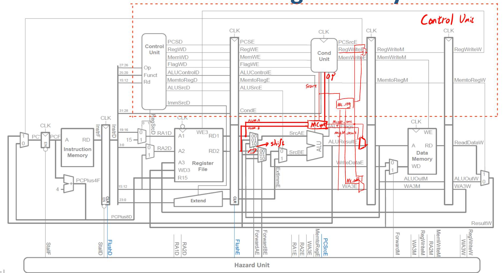
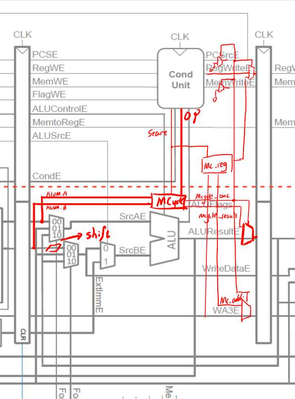
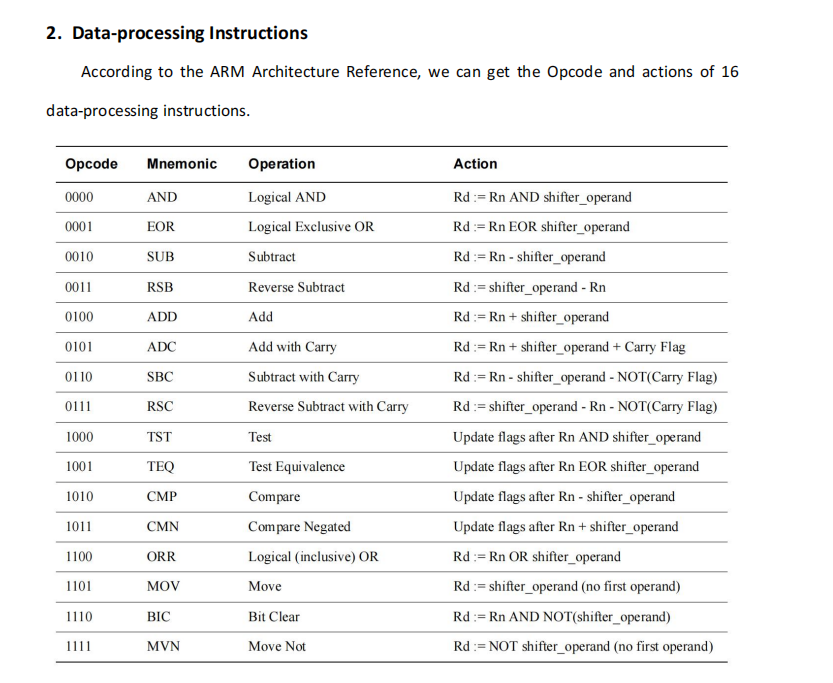
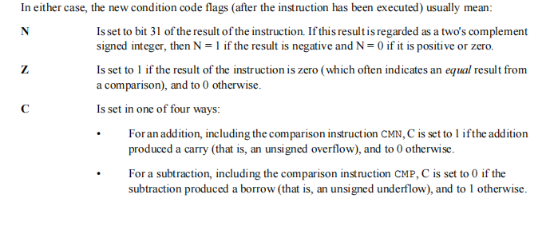
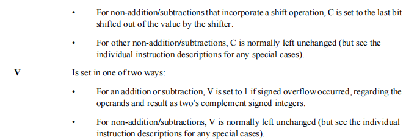
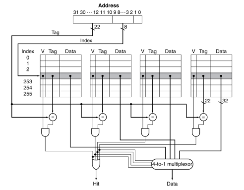
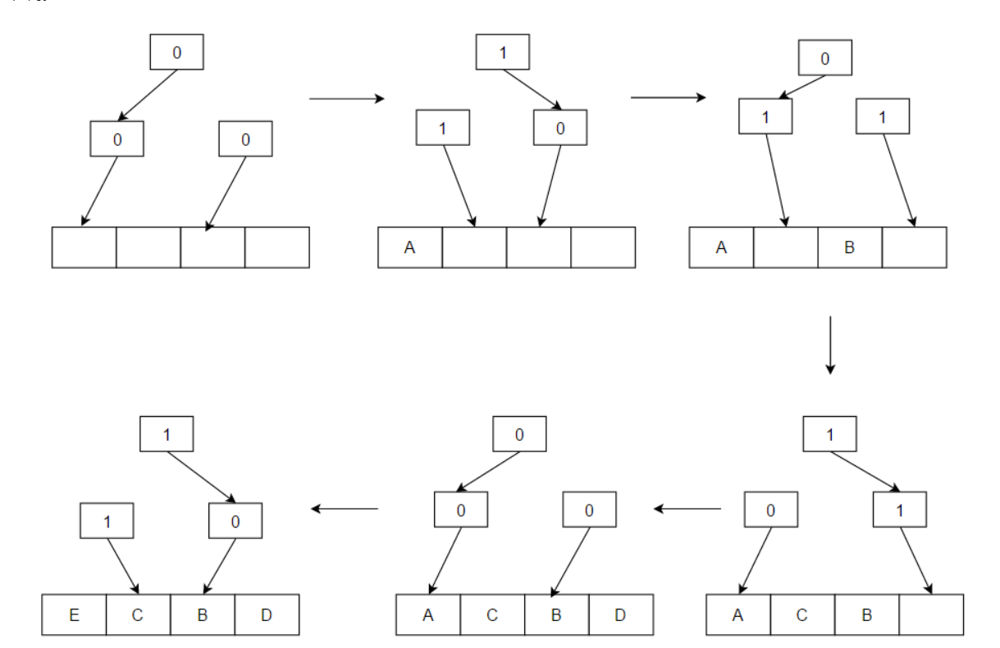
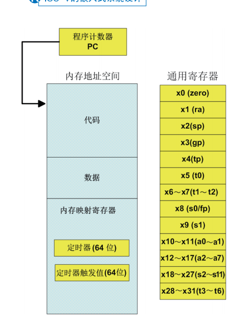
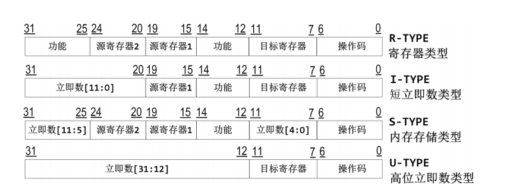

# The SME309 Project Introduction

## Q1
第一问是让我们完成一个处理器的流水线结果，并且用Forwarding，Stall，Flush来处理各类出现的Hazard。

Hazard 分类（Data hazard, Control hazard）
下面我们分别讲一下我们的解决策略，由于这部分上课讲的也比较清晰，所以我们不做过多的解释。

这边建议直接抄PPT，把PPT上的Forwding图，解决策略和代码一抄就好了。



以下是我们不太一样的地方：

（1）我们的寄存器模块分为两部分，一部分是data的寄存器，一部分是condition的寄存器。主要原因是希望在之前的代码基础上不作过多的改动，之前代码Decoder和CondLogic都在Control Unit里面，所以这边我们在Control Unit里面添加寄存器，状态的寄存器包括了D2E，E2M，M2W。并在某个信号该输出的地方输出，不会将其它多余的wire信号放在我们的顶层中，简化了代码，增加了可读性。

（2）由于新的图不包括shift和Mcycle模块，所以我们这边要添加Shift和Mcycle。我们把这两个值添加到如下图所示的地方，shift添加到E层,主要原因是Mcycle使用的是不移位的Register值。所以我们要保留原本的操作数留到E层，一个直接给MCycle，一个给ALU部分。

（3）对于Mcycle，我们将Mcycel和之前一样，放到和ALU同级别的地方，可以这样认为，使用Mcycle的时候就不能用ALU，当Mcycle运行的时候，将Busy信号输出，把所有的寄存器模块阻塞（第一问）。其它对于更详细的Mcycle流程，就不在Q1地方详细描述了，我们会将这部分移动至Q2的时候介绍它的工作流程.

我们利用Lab2的testbench进行了充分的仿真，仿真波形图如下（regbank）：

汇编语言如下：


## Q2 Non-stalling CPU for multi-cycle instructions.

在Non-stalling的处理中，我们可以通过在MCycle运行过程中不出现Hazard开始，一步步的来思考我们需要做什么。

1、首先第一步就是，我们需要记录MCycle计算的数据输出到哪里去，这里就要保存下Addr的值；

2、同时当数据计算出来的时候，我们暂停掉当前即将输出E的数据（并保存），并将这个数据替换成MCycle的输出值。

3、最后对于Condition Unit模块输出值，PCSrc = 0, RegWrite = 1&Exution(是否运行)，MemWrite = 0，这几个值都要在MCycle输出的周期同时输出。

搞清楚不出现Hazard的情况，出现Hazard的情况就比较好做了。

1、判断Hazard用我们第一步存下的MCycle的目标地址来和RA1和RA2来进行判断或者下一个指令是否要启动MCycle，如果相同，将会对F，D stage暂停，对E stage清除（相当于插入Nop），这一步相当于暂停前面F，D，E stage的运行，并让M和W周期的值不受影响（因为他们没有问题）。直到MCycle完成计算。

在考虑完需要做什么之后，下一步我们进行分析，怎么实现：

对于第一条，我们需要构造一个reg寄存器，来存输出地址的值。

对于第二条，我们构建了一个MCycle_out的值，MCycle_out = Busy_reg & ~i_Busy; Busy_reg是保存上一个周期是否是Busy，这个代码其实就是为了得到Busy的下降沿周期，在该周期我们进行暂停并输出真实结果。这个结果将会连接到Stall F, D, E，暂停这三个Stage的信号。

对于第三条，我们再次利用MCycle_out这个值，当用Mcycle_out拉高时，这三个信号分别置为0，1，0。在实际设计的过程中，我们不需要考虑是否运行的情况，因为当该指令不运行的时候Start信号不会来搞，整个MCycle模块都不会运行。

对于Hazard的情况，我们新创立MCycle_Stall = MCycle_Stall = ((MCycle_addr=RA1) || (MCycle_addr=RA2) || StartD) && Busy;

经过上述步骤Q2完成，下面是我们的tb波形验证：

下面是我们的tb的汇编语言：




## Q3 Expand the ARM processor to support all the 16 Data Processing Instructions.

在写第三题的时候，我们详细读了Arm的开发手册：



在16种功能中，我们已经完成了其中的6种，需要扩展剩下的10种功能，包括ADC，BIC，EOR，MOV，MVN，RSB，RSC，SBC，TEQ，TST

对于这些功能我们先要明确需求：

ADC：主要是增加了Carry信号的判断；

BIC：和AND很像，一个是保留置为1的位置，一个是清除置为1的位置，都可以用AND；

EOR：异或，是之前没有实现的操作类型，需要增加ALU输入的Control位宽，并增加异或单元。

MOV: 传送，可以选择将加或减的第二位置零，也可以用新的方法；

MVN：同样是传送，MOV取反即可；

RSB：反向减法，B-A，在A和B进加法器的取反前反转一次；

RSC：反向减法加Carry信号 -！Carry；

SBC：借位减法， -！Carry；

TEQ：EOR加上Nowrite

TST:  AND加上Nowrite

在考虑了需求的基础上，我们再分析如何实现：

1、对于SBC、ADC和RSC我们往ALU中引入了Carry信号，并且用Carry_use来判断是否需要使用Carry信号

wire Carry_ALU = Carry_pre & Carry_use;

用这个方法，无论是否使用Carry在加法器里面都用同一个信号Carry_ALU，保持了一个加法器。

2、对于BIC、MVN加入Reverse_B信号（从decoder中判断），Re_src = Reverse_B ? ~ Src_B : Src_B BIC和AND用同一种方法，在输入进方法前判断是否用反转。同理MVN和MOV也共用一种方法。

3、对于EOR增加异或符号 3'b100:  ALUResult = Src_A ^ Src_B。在增加异或的同时，考虑到我们要用到三位ALUControl。但我们只用了5种操作符，有三种操作符的空缺。这种情况下，我们考虑到尽量减少代码的修改和少增加选择器，所以我们为MOV和MVN单独设置了一种方法 3'b101:  ALUResult = Re_src。

4、对于RSB和RSC，我们增加了一个Reverse_src的信号，从decoder中判断，这个信号在输入进ALU前对SrcA和SrcB交换位置。

5、在decoder中对TEQ和TST加入nowrite判断

同时我们要考虑NZCV的赋值：





在NZCV赋值的时候，我们并没有按照严格的手册来进行。对于C的赋值，除了加和减及相关指令外，当用到shift数值时，C为移出去的最后一个值，这个我们沿袭前面几次Lab的要求（并询问过学长这个要求），认为没有必要实现，就没有变化。但对其它部分，我们均完成了NZCV的考虑。

基于这些操作后，我们成功做出了DP指令的16种指令的拓展。

下面是tb和对应的汇编语言：


## Q4 A 4-way set associative cache between memory and ARM CPU.



​	根据上图所示的结果，我们构建出了基本的cache结构。我们分别用四个1024大小的reg矩阵来构建，大小分别是1、1、22、32，代表的内容分别是valid，dirty，tag和data。之所以用1024个矩阵主要原因是我们可以用index的前两位来区分set0-4，降低了我们写if-else的个数（虽然if-else和0-4表示综合出来资源应该相差不大），增加了代码的可读性。将56位的数据分开也是相同的原因，valid, dirty, tag, data，四个数据操作起来相对独立，所以可以用不同的信号来表示，这样不论是写代码的时候操作和判断比较方便，debug的时候也比较清晰。

​	在替换策略部分，我们选择了Pseudo-LRU的算法，也叫伪LRU。因为实际的LRU在实现上比较困难，且会消耗相当大的资源（涉及排序）。所以为了降低资源的使用，并且达到类似LRU的算法，我们引入了伪LRU算法，伪LRU实现如下图所示。



​	总而言之这个方法就是用一个树状结构来选择该去的位置，每次选择某一位的时候，上面的值和下面指向的值就要进行翻转。下一次指向的就是翻转后的值。如上图所示，达到一种实现LRU的结果。但是，这个方法也只是近似的LRU，在部分情况下，该方法所替换的不是最久未使用的单元。综上伪LRU方法的替换效果应该略差于LRU，好于随机替换，并且它的资源远小于LRU。尤其是在我们实现的情况下，有256组记录数据，用LRU绝对是一种非常奢侈的资源消耗。

​	除了替换策略外，正常情况下，cache会优先选择hit和empty的位置，当cache满的时候才会选择Pseudo-LRU。同时我们模拟了一个memory 5个周期penalty，当memory给到memory_ready信号的时候，才让cache赋值。当处于!Hit状态时，将整个处理器暂停。

之后考虑的就是 write-allocate 和 write-back，write allocate就是write miss时，修改memory的值，并且赋给Cache；我们这边属于特殊情况，一个block当中只有一个data。所以这边的write allocate就是修改memory值和Cache即可，不用从Memory中调取data。

write-back是，当set中的值被覆盖时（write or read），如果block中的值是dirty的，就将block中的dirty值给赋到memory中。

所以对于这种情况，我们分为两步进行分析：

一步是Cache内部赋值，需要考虑三种情况：

1、Hit并且是Write的情况，直接写入数据。

2、!Hit并且是Write的情况，修改Tag, data和Dirty，valid。

3、!Hit并且是Read的情况，修改Tag, data和Dirty，valid。

后两种情况都需要等到Memory的ready信号才能进行，保证数据传输成功。

实现代码如下

```verilog
always @(posedge clk) begin
        if(!Hit & !MemWrite & memory_ready) begin
            Data_Block_valid[{BLK_NUM, Addr_index}] <= 1'b1;
            Data_Block_Tag[{BLK_NUM, Addr_index}] <= Addr_tag;
            Data_Block_Data[{BLK_NUM, Addr_index}] <= ReadData;
            Data_Block_Dirty[{BLK_NUM, Addr_index}] <= 1'd0;
        end
        else if(Hit & MemWrite)begin
            Data_Block_valid[{BLK_NUM, Addr_index}] <= 1'b1;
            Data_Block_Data[{BLK_NUM, Addr_index}] <= WriteData;
            Data_Block_Dirty[{BLK_NUM, Addr_index}] <= 1'd1;
        end
        else if(!Hit & MemWrite & memory_ready)    begin
            Data_Block_valid[{BLK_NUM, Addr_index}] <= 1'b1;
            Data_Block_Tag[{BLK_NUM, Addr_index}] <= Addr_tag;
            Data_Block_Data[{BLK_NUM, Addr_index}] <= WriteData;
            Data_Block_Dirty[{BLK_NUM, Addr_index}] <= 1'd1;
        end
    end
```

第二步是对于Cache的输出情况:

1、Write-back的实现：当没有hit的情况，并通过我们的选择set模块得到的set非空并dirty，则将这个数据传输到Memory当中。

2、对于处理器需要的数据，直接将Data输出。

实现代码如下

```verilog
assign Data = Tag0_equal ? Data_Block_Data[{2'd0, Addr_index}] : 
                  Tag1_equal ? Data_Block_Data[{2'd1, Addr_index}] :
                  Tag2_equal ? Data_Block_Data[{2'd2, Addr_index}] :
                  Tag3_equal ? Data_Block_Data[{2'd3, Addr_index}] : 32'dz;

assign MemWrite2Memory = (!Hit & Data_Block_valid[{BLK_NUM, Addr_index}] & Data_Block_Dirty[{BLK_NUM, Addr_index}]);
assign Data2Memory = Data_Block_Data[{BLK_NUM, Addr_index}];
assign MissAddr = {Data_Block_Tag[{BLK_NUM, Addr_index}], Addr_index, 2'b00};
```

经过上述步骤，我们就可以完成对Cache的构建，一下是对Cache的tb和汇编文件

# Bonus1 RiscV32I

在RISCV32I当中有几个与ARM不一样的地方：

1、寄存器有32个，其中R0表示0



RV32I 基本指令格式如图 3-5 所示，RV32I 的基本指令格式只有 4 种，分别是寄存器类型（R-TYPE）、短立即数类型（I-TYPE）、内存存储类型（S-TYPE）、高位立即数类型（U-TYPE）。



为了方便跳转指令，RV32I 还包含两种衍生格式 B-TYPE（Branch，条件跳转）与 J-TYPE（Jump，无条件跳转）。B-TYPE 衍生于 S-TYPE，B-TYPE 除了立即数的位排列与 S-TYPE 不一样外，其他的格式都与 S-TYPE 一样。J-TYPE 也是通过类似的方式衍生于 U-TYPE。用这种方式衍生新格式的目的是便于硬件产生目标地址。

上面这些格式，除 R-TYPE 外，其他的格式都需要把最高位（第 31 位）做符号扩展，以产生一个 32 位的立即数，作为指令的操作数。

上图图所示的这些指令格式非常规整，其操作码、源寄存器和目标寄存器总是位于相同的位置上，简化了指令解码器的设计。
